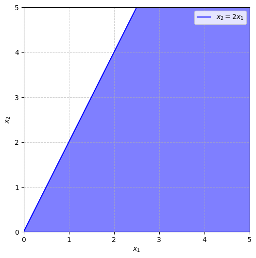
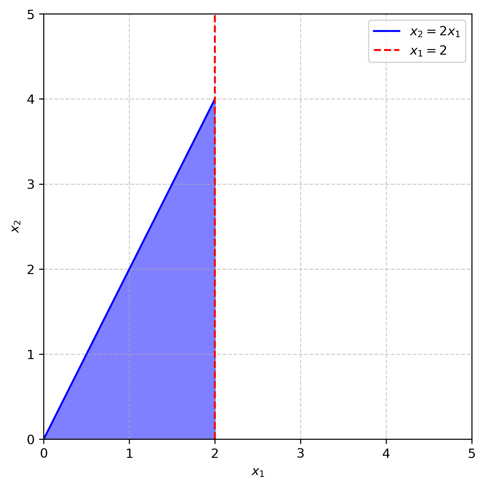

# What is a data model?

*An introduction to my notation and perspective of data science*

I have studied data science at Georgia Tech for five years, tutored for four, and now decided to start a blog series. I start my introduction to data science from a mathematical approach. If you understand math fundamentals and machine learning terminology before looking at Python, models will make much more sense. Code is not the important part to understand, and unless you are practicing, you should never code without documentation, open-source searches, and LLMs (Cursor AI).

[Here is an extended explanation of this article in video form.](https://www.youtube.com/watch?v=BNF2zdyJAQE)

## Optimization Problem

The first definition to know is **optimization problem** — to maximize or minimize a function.

$$ \max_x f(x) \quad \min_x f(x) $$

The input that changes to optimize the function, $x$, is called the **variable**. The function being optimized, $f(x)$, is the **objective**. The result of an optimization problem is the **optimal value**, $f^*$, and **optimal solution**, $x^*$, a value of the variable that produces the optimal value. In math notation, $f^*$ equals the minimum and $x^*$ is the argument that minimizes $f(x)$.

$$ f^*=f(x^*)=\min_x f(x) \quad x^*=\arg\min_x f(x) $$

A maximization problem is equivalent to a minimization problem where $f(x)$ is multiplied by $-1$. So going forward we only need to discuss minimization to cover all of "optimization".
An optimization problem can also have parameters and constraints. **Parameters** are numbers that describe a problem. Values of parameters must be selected before a single solution is produced. The parameters are constant with respect to the input variables $x$ and can't be changed while $f$ is being minimized. **Constraints** are statements (equations, inequalities, or domain restrictions) that change what values of the input variables $x$ are possible. $x^*$ must satisfy the constraints so $x^*$ is not always the global minima of $f$.

Here is an example of an optimization problem:

There are three parameters, $ a, b, c, $ that, when selected to have different values, can change the solution, $x^*$. The feasible region is the set of $x$ values that satisfy the constraints. For this problem, you could visualize the **feasible region** as the segment on the number line going from $0$ to $c^2$.

What is the solution to this optimization problem? Consider three cases: $a > 0$, $a = 0$, $a < 0$. When $a > 0$, the $x$ value in the feasible range $[0, c^2]$ that minimizes $ax + b$ is clearly $x = 0$. When $a = 0$, the objective always equals $b$ and every feasible value for $x$ is optimal. When $a < 0$, the $x$ that minimizes $ax + b$ in the range $[0,c^2]$ is clearly $x = c^2$.

Let's look at another example. This is a **linear program** since the objective and constraints are linear functions.

Now $x = (x_1, x_2)$ represents two input variables that can be changed to change the value of $f$. To find the optimal solution for $x$, let's graph the feasible region.

The optimal solution for $x$ must lie in the first quadrant below the line $y = 2x$. The region is **unbounded** since the boundary region allows for $x_1$ and $x_2$ to approach infinity. Is there still an optimal solution? If $a_1$ and $a_2$ are positive, $x_1$ and $x_2$ have to be as small as possible to minimize $f$. So the problem does have a single optimal solution $x = (0,0)$. If $a_1$ is negative, then $x_1$ is pushed to be as large as possible and approaches infinity. So the problem is unbounded and has no solution. What if $a_1$ is zero and $a_2$ is positive? Then $x_1$ can be any value and $x_2$ must be as small as possible. So every value on the half-line $x_1 > 0$, $x_2 = 0$ (the positive $x$-axis) is an optimal solution. In any linear program, one of these three cases must occur: exactly one optimal solution, no optimal solution, or infinitely many optimal solutions.

The boundary region can become bounded by adding a third constraint, say $x_1 = 2$.

Now the problem will always have at least one optimal solution. If $a_1$ and $a_2$ are positive, the optimal solution is still $(0,0)$. If $a_1$ and $a_2$ are negative, then $x_1$ and $x_2$ are as large as possible and the optimal solution is $(2,4)$. More formally, you could think about comparing the objective value at the three boundary points, $f(0,0)$, $f(2,0)$, $f(2,4)$, and the minimum equals the optimal value.

## Types of Models

Next, I introduce two types of models: data model and decision model. A **data model** estimates the value of parameters from a dataset. For example, in the linear model $\hat y = ax + b$, $a$ and $b$ are chosen to minimize sum of squared error on the training dataset.

A **decision model** chooses a value of a decision variable based on known values of the parameters. For example, if the slope and intercept are known, the $x$ value that minimizes $y$ over a bounded range of $x$ values is clear.

## Types of Variables

Next, let's discuss types of variables. **Continuous** variables have an infinite number of values in a bounded range because there is an infinite amount of decimal places to select. For example, a continuous variable could equal $1.123123123...$ or $2.0000$. A **discrete** variable has a finite number of values within a bounded range. A specific case is an integer variable, where the possible values are the integers. Within the bounds $[-2, 3]$, there are exactly 6 possible values for an integer variable: $\{-2, -1, 0, 1, 2, 3\}$. An integer variable could be used to describe the number of items sold when items are not divisible. A discrete variable is not always integer, for example $x = \{0, 0.5, 1, 1.5, 2, 2.5, …\}$ is discrete.

A **binary** variable is a discrete variable with 0 and 1 as the only possible values. A binary variable could easily represent a yes-no scenario. For example, let $x = 1$ when it's sunny and $x = 0$ when it's not sunny. If solar panels earn $90$ when it's sunny and $0$ otherwise, you can easily define $f(x)=90x$ to be the dollars earned.

A **categorical** or nominal variable is a discrete variable where the possible values do not represent a numerical relationship. For example, if $x$ represents whether it's sunny, cloudy, or rainy, we should not define $x = 0$ if sunny, $x = 1$ if cloudy, $x = 2$ if rainy. This is because numerical relationships like rainy being twice the value of cloudy don't make sense. Instead, categorical variables are mathematically expressed as multiple binary variables. $x_1 = 1$ if sunny 0 otherwise, $x_2 = 1$ if cloudy 0 otherwise, $x_3 = 1$ if rainy 0 otherwise. Functions of multiple binary variables can still be cleanly written. For example, earn $90$ when it's sunny or cloudy and pay $10$ maintenance when not sunny could be expressed as $90(x_1+x_2)-10(1-x_1)$.

**Random** variables take on certain values with known probabilities. A model involving random variables is called **stochastic** or **probabilistic** (instead of **deterministic**).

## Regression and Classification

Two common types of data models are regression and classification. **Regression** is a problem where a continuous variable is predicted as a function of other variables. A regression model follows $ \hat y=f(x_1, x_2, ..., x_p) $ The input variables could be continuous or discrete as long as they are not categorical. The most basic regression model is **linear regression**: $y=\beta_0+\beta_1 x_1 +\beta_2 x_2+... +\beta_p x_p$. 

In classification, a **categorical variable** is predicted as a function of other variables. Again, the input variables can not be categorical. The values of the output variable $y$ are called classes. The standard classification model is **logistic regression**.
